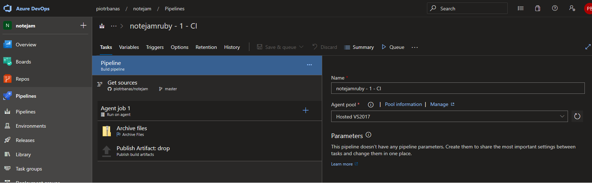
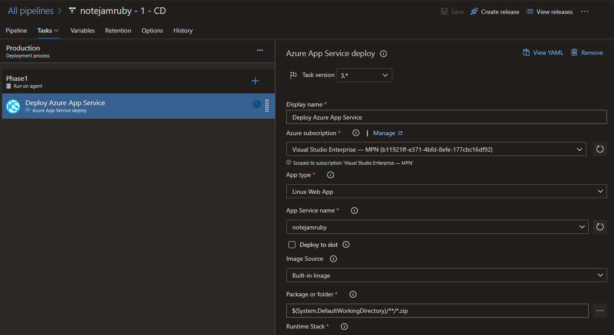

| **Date**   | **Author**    | **Version** | **Comments**                                                   |
|------------|---------------|-------------|----------------------------------------------------------------|
| 2020-01-14 | Piotr W. Banas| 0.1         | Initial draft version                                          |

Table 1 - Version history

### Description

Notejam is a simple application provided by Nordcloud for the purposes of candidate evaluation. Candidates can choose from multiple implementations of Notejam application in different languages and frameworks.
Candidates are tasked with implementing a simple CI/CD solution in accordance with provided requirements.

### Implementation

1. Ruby on Rails
    1. The app is deployed as an Azure App Service [https://notejamruby.azurewebsites.net/signin]

    2. Tests are invoked at push as a github workflow [https://github.com/piotrbanas/notejam/blob/master/.github/workflows/rubyTests.yml]

        (Defined in `.github/workflows/rubyTests.yml`)

    3. Build is defined in Azure Pipelines: 
        
    
    4. Release:
        

    5. Alternatively, a deployment can be triggered from a local git repository:

        `git subtree push --prefix=rubyonrails/notejam azure master`
        
        This uses a Kudu deployment script: `.\rubyonrails\notejam\deploy.sh`
    
    6. Note: currently the app is not fully functional, as the Azure Web App doesn't support SQLite. The complete solution would use a proper database.

2. Python
    1. Tests defined in `.github\workflows\pythonapp.yml`

    2. Build and release defined as a Azure Multistage Pipeline: `\azure-pipelines.yml`

### Business Requirements

1. The Application must serve variable amount of traffic. Most users are active during business hours. During big events and conferences the traffic could be 4 times more than typical. 
    1. The App Service can be configured with Auto Scaling (not available in my Free Tier Subscription)
2. The Customer takes guarantee to preserve your notes up to 3 years and recover it if needed. 
    1. Automatic backup of the app and databases (not available in my Free Tier Subscription) can be configured with a desired retention (days).
3. The Customer ensures continuity in service in case of datacenter failures. The Service must be capable of being migrated to any regions supported by the cloud provider in case of emergency. 
    1. The App Service can be cloned into a App Service Plan in another region. Both ASPs will be kept behind Azure Front Door. Databases can also be geo-replicated.
4. The Customer is planning to have more than 100 developers to work in this project who want to roll out multiple deployments a day without interruption / downtime. The Customer wants to provision separated environments to support their development process for development, testing, production in the near future. 
    1. A properly configured branching policy and environments in a CI/CD pipeline will ensure this.
5. The Customer wants to see relevant metrics and logs from the infrastructure for quality assurance and security purposes. 
    1. App Insights, Logs and Metrics can be enabled for the App Service.